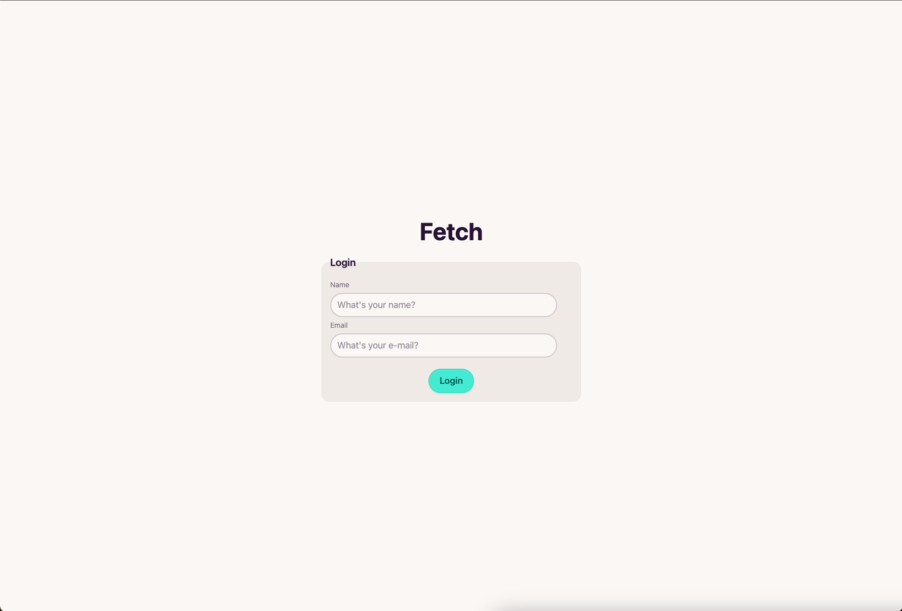
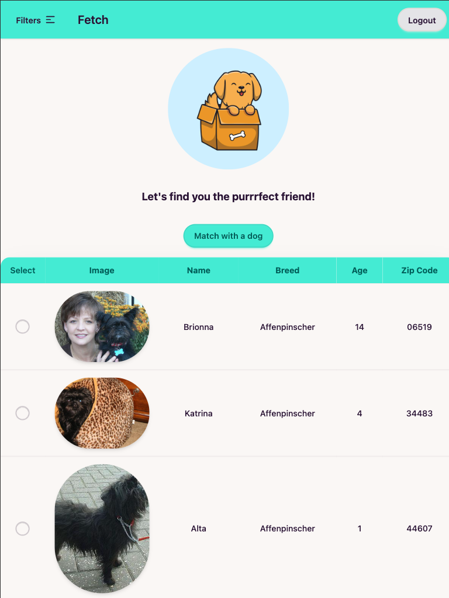
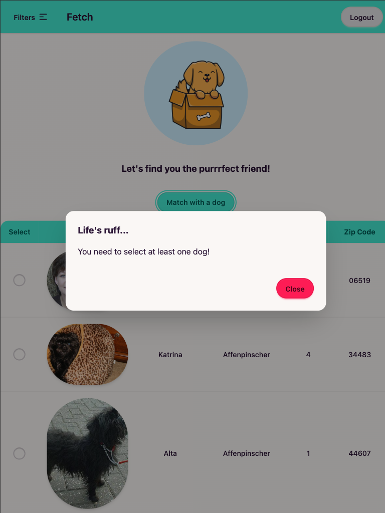
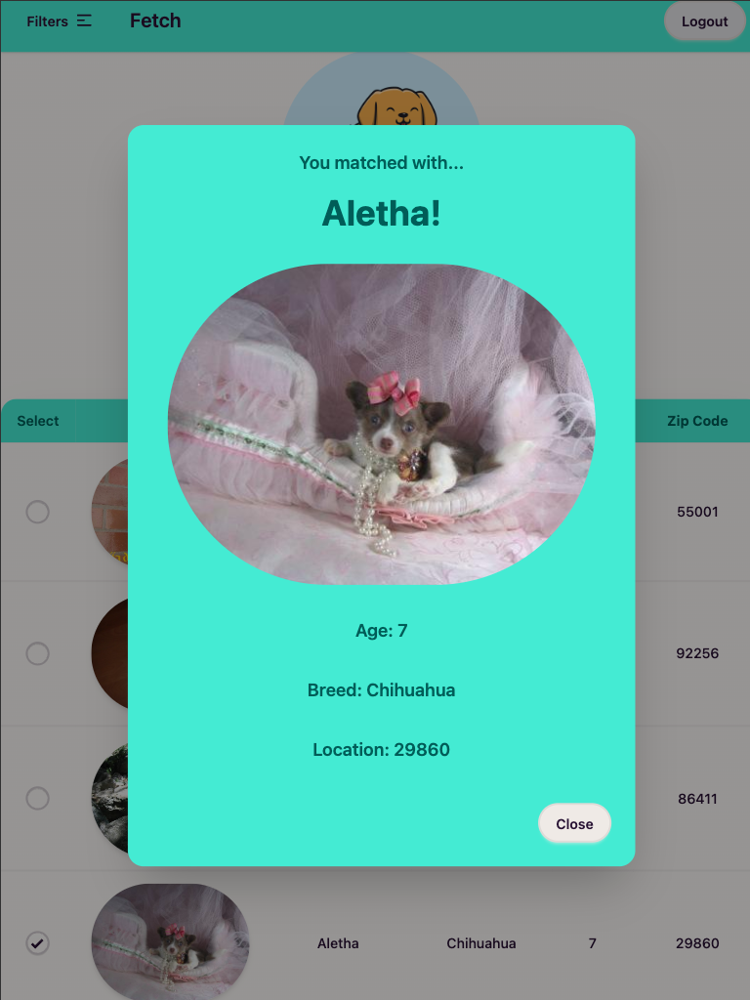
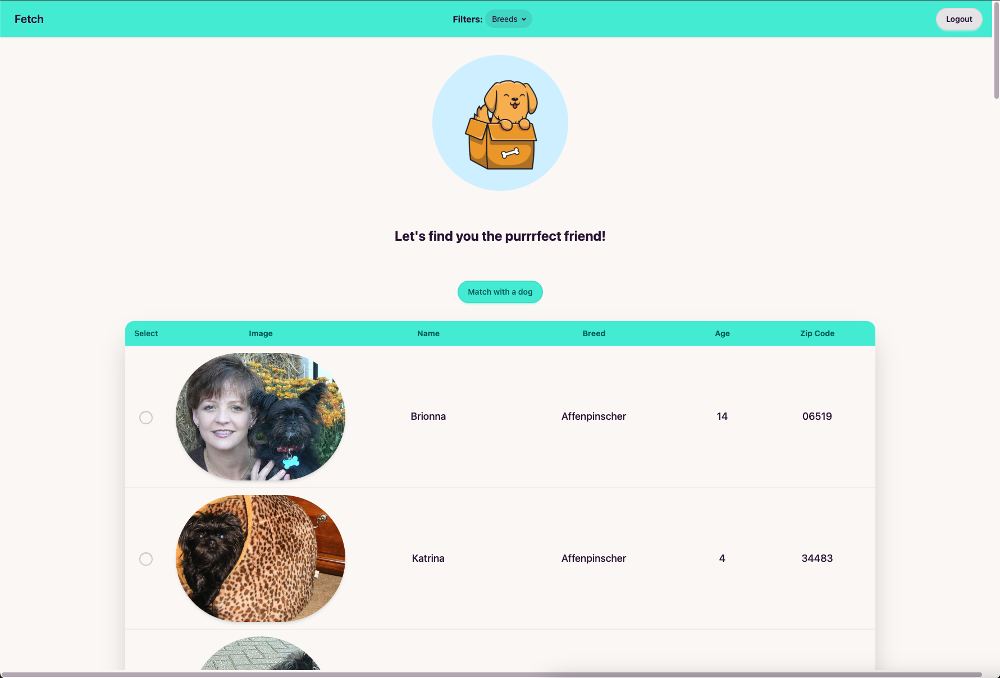

# Fetch Take Home Project
This project was created as a requirement for an interview with Fetch.

This project leverages:
1. **NextJS 15**
2. **React**
3. **Tailwind CSS**
4. [**daisyUI**](https://daisyui.com/) (as a Tailwind CSS plugin for component class names)
5. A teeny tiny bit of **lodash** (just the debounce function)

## How to run locally
1. You need [**NodeJS version > 18.18.0**](https://nodejs.org/en) installed locally. I personally use a version management tool [**NVM**](https://github.com/nvm-sh/nvm) to work on multiple applications with different version requirements.
2. Once you have **Node** and **NPM** configured on your machine, simply run `npm install` in your terminal to install the required dependencies in the `package.json` file.
3. Finally, you should be able to just run `npm run dev` in your terminal to run a local version of the application, and visit it at the default hosting space, http://localhost:3000 in your browser.

## Visit the hosted version
You can visit the Vercel hosted version [**here**](https://fetch-takehome-vert.vercel.app/).
> Please note that modern browsers like as Safari and Chrome block Cross-Site tracking and 3rd party cookies by default, so the live application may not work unless you change these settings.

## Some pictures of UI/UX
### Login

### Mobile/iPad view

### Error state (no dogs selected)

### Matched state

### Desktop view
